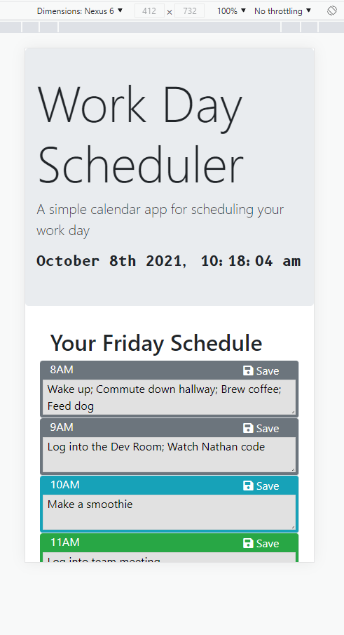

# Work Day Scheduler

This work day scheduler is a calendar application that allows a user to save events for each hour of the day. This app runs in the browser and feature dynamically updated HTML & CSS powered by jQuery & Moment.js libraries.

This application is fully responsive and leverages BootstrapCSS for the grid and contextual backgrounds used to convey past, present, and future time blocks, by applying "bg-secondary", "bg-info", and "bg-success" respectively.

No need to refresh, this application will update the time block class's when the hour changes.

## Satisfied Acceptance Criteria

```
GIVEN I am using a daily planner to create a schedule

WHEN I open the planner
THEN the current day is displayed at the top of the calendar

WHEN I scroll down
THEN I am presented with time blocks for standard business hours

WHEN I view the time blocks for that day
THEN each time block is color coded to indicate whether it is in the past, present, or future

WHEN I click into a time block
THEN I can enter an event

WHEN I click the save button for that time block
THEN the text for that event is saved in local storage

WHEN I refresh the page
THEN the saved events persist
```

## Screenshots

### Desktop

Desktop friendly use of BootstrapCSS grid.


### Mobile

Mobile friendly use of BootstrapCSS grid.



### Edit Feature

Example of a time block with values populated from local storage.


### Save Button

When users edit a time block, the "primary" class is applied to draw attention to save the changes.


### Hours Key

'Hours' key added to help users understand contextual meaning of the background colors.


## Github Deployed Application

[https://bravotango.github.io/Work-Day-Scheduler/](https://bravotango.github.io/Work-Day-Scheduler/)
